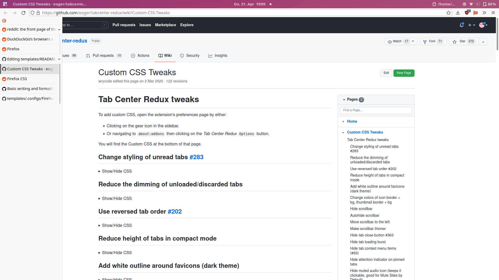

# Personal configurations for Mozilla Firefox
I use vertical tabs via [Tree Style Tabs](https://addons.mozilla.org/de/firefox/addon/tree-style-tab/) with some CSS tweaks for an auto-expanding sidebar to fit my preferences:
## Screenshots
### Expanded

### Collapsed

